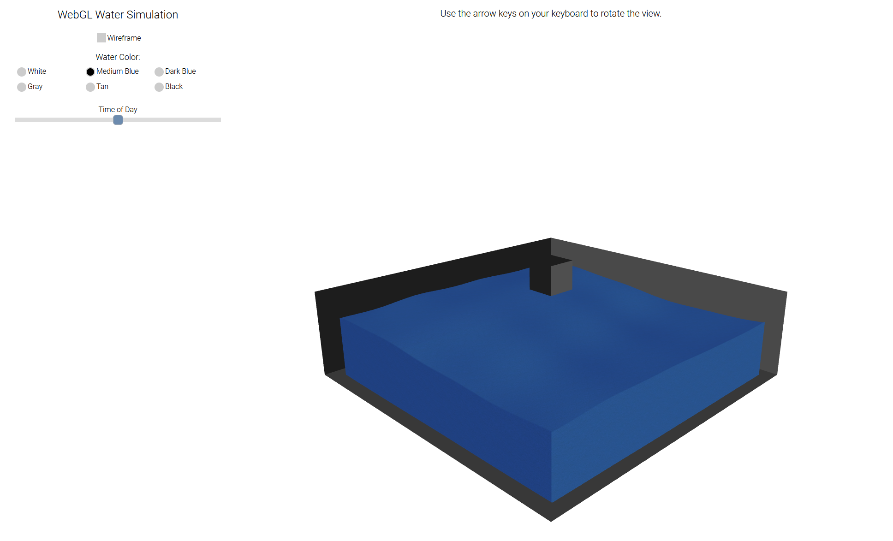
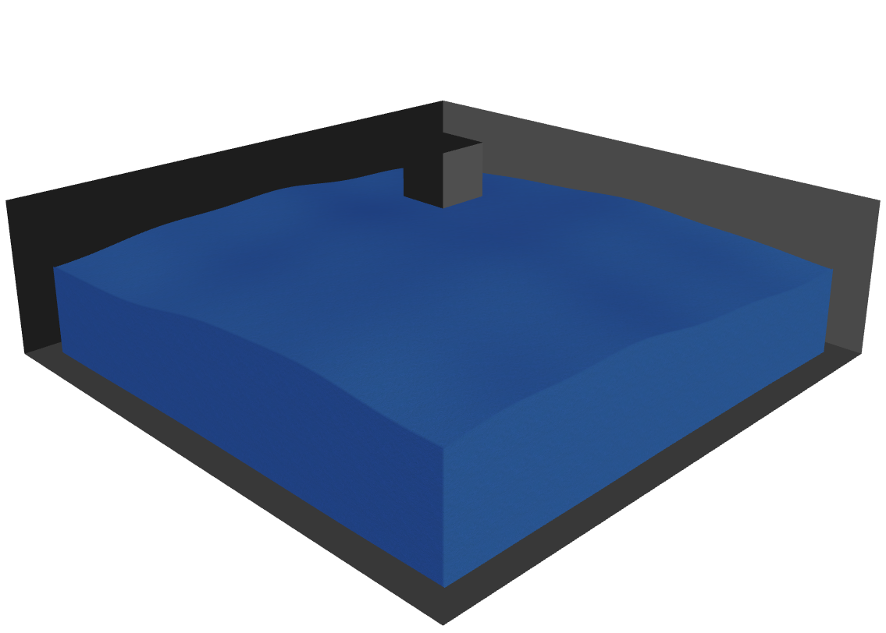

# [WebGL Water Simulation](https://dkillough.github.io/PoolCorpWaterSim/)

[Original code by @gtongue](https://github.com/gtongue/WebGLWater) | [Original version host location](https://gtongue.github.io/WebGLWater/)

Modified by @dkillough and @NateD247 for CS 354 Computer Graphics; hosted at https://dkillough.github.io/354-WebGLWaterSimulation/

Modified further by @dkillough for [PoolCorp NPT](https://www.nptpool.com/) on behalf of [Fair Worlds](https://www.fairworlds.com/)

## Overview

WebGL Water Simulation is a visualization of waves. Rendered using WebGL and GLSL.

## Features

- ### Moving Camera
  Use the arrow keys to rotate the view or tilt the camera up and down
  
- ### Wireframe View
  Check the box at the top to enable wireframe mode.
  
- ### Adjusting Water Color
  Six water color options are available to you. Each color is based off of magazine provided by @JulianFW
  
- ### Time of Day
  Slider that adjusts opacity of the water (for now). Needs further examination of a function to more accurately portray morning (left) vs. midday (middle) vs. evening (right).

## Gerstner Wave Simulation
Gerstner waves are used to generate the surface of the water. Gerstner waves are modified sine waves with sharper peaks and deeper valleys, which are useful for such a purpose as simulating water for 3D graphics applications. For more reading on Gerstner waves, please see the appropriate Wikipedia article on [trochoidal waves](https://en.wikipedia.org/wiki/Trochoidal_wave).

